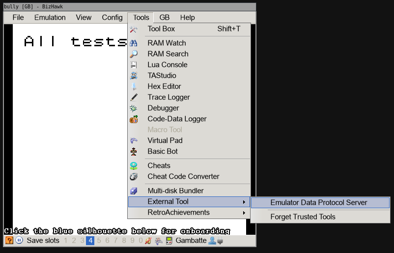

# How to use Poke-A-Byte

## 1. Install a compatible emulator.

###  BizHawk

1. Download the emulator at https://tasvideos.org/Bizhawk.
2. Download the `EDPS.Bizhawk.dll` from the 
[release page](https://github.com/PokeAByte/PokeAByte/releases/latest) 
3. In the BizHawk folder (where `EmuHawk.exe`) is found, create a folder named `ExternalTools` if it does not exist.
4. Place the `EDPS.Bizhawk.dll` in the `ExternalTools` folder.
5. Start BizHawk and load a ROM
6. Once the ROM is loaded, select "Tools" -> "External Tool" -> "Emulator Data Protocol Server"

###  Super Shuckie 2

1. Download the emulator at https://github.com/SnowyMouse/supershuckie/releases/latest
2. Open the emulator
3. Select "Settings" -> check "Enable Poke-A-Byte integration".
4. Load a ROM.

### Retroarch, Super Shuckie 1

Support for RetroArch and Super Shuckie 1 will be discontinued in the future.

## 2. Downloading and opening Poke-A-Byte

To start Poke-A-Byte, [download](https://github.com/PokeAByte/PokeAByte/releases/latest) the version build for your 
operating system, unpack the Zip-folder, and click on `PokeAByte.Web`.

A new page should open automatically open in your default browser. If not, go to http://localhost:8085/ui/mappers.

## 3. Installing a mapper

On the above mentioned page, open the `Download mappers` box. Then find the mapper you want to install and check the box
next to it. Then click "Download Selected".

## 4. Using a mapper

Go back to the "Load Mapper" box (open by default). Click into the input-box under the label "Select the mapper you would like to load:"
A selection of mappers you have currently installed is presented. Click the one you want to use, then hit "Load Mapper":

**Make sure that exactly one compatible emulator is currently running the game**.

If the mapper was loaded and communication with the emulator was established succesfully, the "Properties" tab should have
automatically opened itself:

You can now open whatever software that depends on Poke-A-Byte, such as Scotts overlays. 

Be aware that the software in question may require specific mappers to function properly. For instance Scotts Generation 1
overlay only works with the Mappers that have "deprecated" in their name. 
