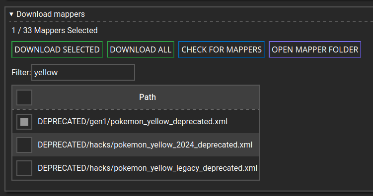
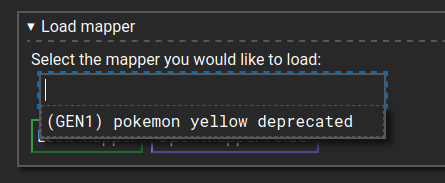
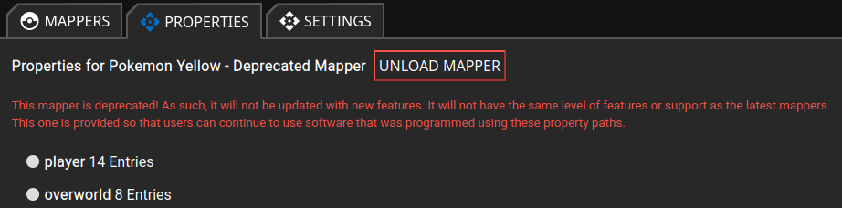

# How to use Poke-A-Byte

## 1. Install a compatible emulator.

The following emulators are currently compatible:

- [Bizhawk](https://tasvideos.org/Bizhawk)
- [RetroArch](https://www.retroarch.com/?page=platforms)
- SuperShuckie (privately distributed)

If you are using RetroArch, note that not all emulator cores work with Poke-A-Byte. You will also need to enable the 
Network Control Interface. You can do this by opening retroarch, going into "Settings", then "Network". There, enable 
"Network Commands" and make sure that "Network Command Port" is 55355 (should be the default).

For Bizhawk, you also need to download the so called External Tool. Currently there are two options available. 
The `PokeAByte.Integrations.BizHawk.dll` is better tested, whereas `Bizhawk-EDPS.dll` should have slightly better 
performance. You download one of these files and copy it into the `ExternalTools` folder that should be located at the same
place that your Bizhawk executable is (`EmuHawk.exe`). If the folder does not exist, create it and then place the DLL file
inside.

Once you started BizHawk and loaded the game ROM, go to `Tools` in the menu bar, hover over the the `External Tools` item
and then select `Poke-A-Byte Integration` or `Emulator Data Protocol Server` depending on which DLL you downloaded.

## 2. Downloading and opening Poke-A-Byte

To start Poke-A-Byte, download the version build for your operating system, unpack the Zip-folder, and click on `PokeAByte.Web`.

A new page should open automatically open in your default browser. If not, go to http://localhost:8085/ui/mappers.

## 3. Installing a mapper

On the above mentioned page, open the `Download mappers` box. Then find the mapper you want to install and check the box
next to it. Then click "Download Selected".

## 4. Using a mapper

Go back to the "Load Mapper" box (open by default). Click into the input-box under the label "Select the mapper you would like to load:"
A selection of mappers you have currently installed is presented. Click the one you want to use, then hit "Load Mapper":

**Make sure that exactly one compatible emulator is currently running the game**.

If the mapper was loaded and communication with the emulator was established succesfully, the "Properties" tab should have
automatically opened itself:

You can now open whatever software that depends on Poke-A-Byte, such as Scotts overlays. 

Be aware that the software in question may require specific mappers to function properly. For instance Scotts Generation 1
overlay only works with the Mappers that have "deprecated" in their name. 

