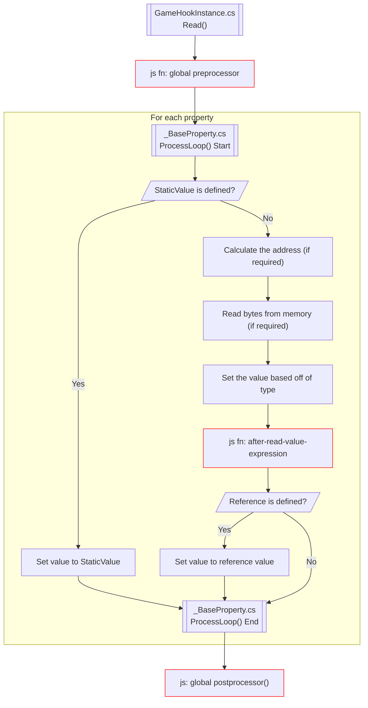

```mermaid
%% Read
flowchart TB
    classDef js stroke:#f00

    StartRead[["GameHookInstance.cs\nRead()"]] -->
    JsGlobalPreprocessor[js fn: global preprocessor]:::js --> StartForEachProperty
    subgraph "For each property"
        StartForEachProperty[["_BaseProperty.cs\nProcessLoop() Start"]] -->

        StaticValueQuestion[/StaticValue is defined?/] 
        StaticValueQuestion --> |Yes| StaticValueQuestionY[Set value to StaticValue] --> EndForEachProperty
        StaticValueQuestion --> |No| CalcAddress
        CalcAddress["Calculate the address (if required)"] -->
        ReadBytes["Read bytes from memory (if required)"] -->

        ReadValue[Set the value based off of type] -->
        AfterReadValueExpression[js fn: after-read-value-expression]:::js -->

        RefIsDefinedQ[/Reference is defined?/] 
        RefIsDefinedQ --> |Yes| RefIsDefinedQY[Set value to reference value] --> EndForEachProperty
        RefIsDefinedQ --> |No| EndForEachProperty

        EndForEachProperty[["_BaseProperty.cs\nProcessLoop() End"]]
    end
    EndForEachProperty --> JsGlobalPostprocessor
    JsGlobalPostprocessor["js: global postprocessor()"]:::js
```
